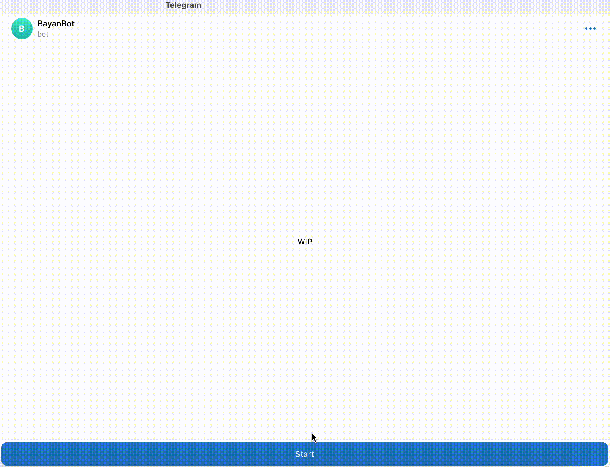
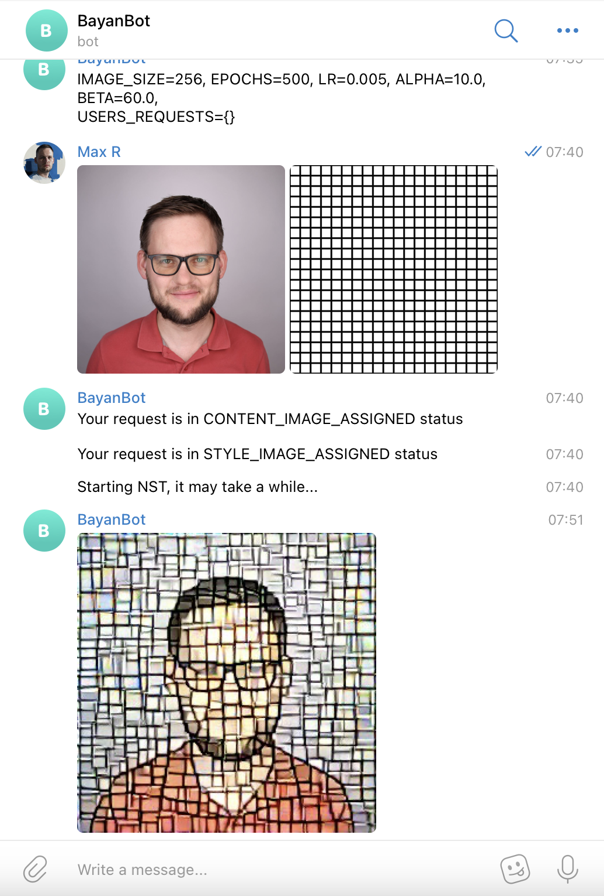
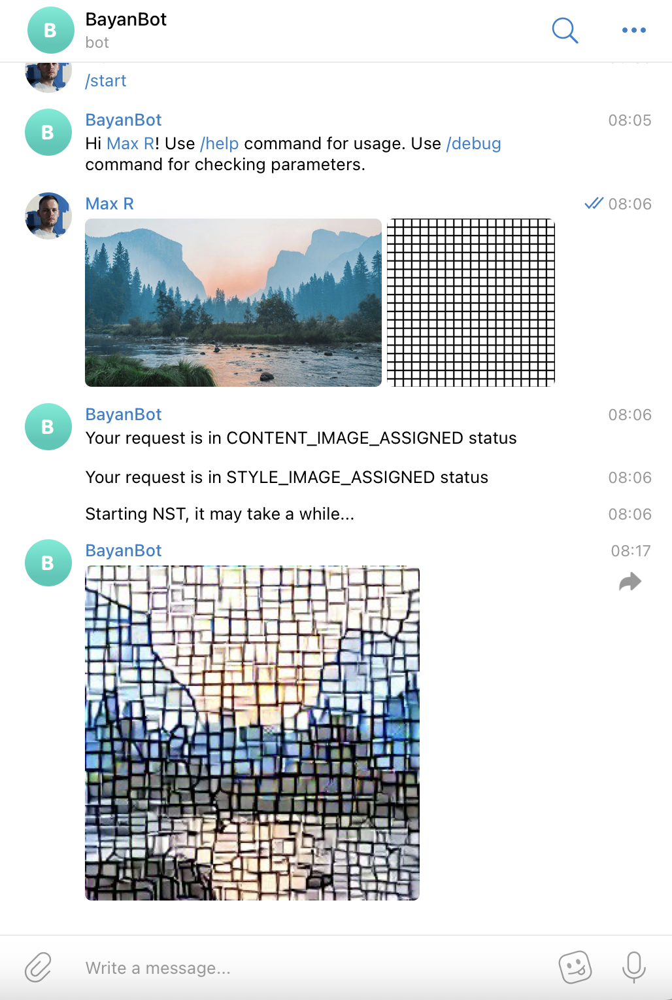

# nst-telegram-bot
A telegram bot providing neural style transfer service.

# Setup
Docker
```bash
git clone https://github.com/masim05/nst-telegram-bot.git
cd nst-telegram-bot
docker build -t nst-telegram-bot .
docker run -d -e TG_BOT_TOKEN=<YOUR_TOKEN> -e IMAGE_SIZE=256 -e EPOCHS=500 -e LR=0.005 -e ALPHA=10  -e BETA=60 nst-telegram-bot
```

Native, tested with python 3.11.4
```bash
git clone https://github.com/masim05/nst-telegram-bot.git
cd nst-telegram-bot
pip3 install -r requirements.txt
IMAGE_SIZE=64 EPOCHS=500 LR=0.005 ALPHA=10 BETA=60 TG_BOT_TOKEN=<YOUR_TOKEN> python app.py
```

Supported environment variables:
 - IMAGE_SIZE - size of the result image
 - EPOCHS - number of epochs to learn
 - LR - learning rate
 - ALPHA and BETA - weights of content_loss and style_loss respectively
# Usage
Available commands:
 - /start - general greeting
 - /help - usage info
 - /debug - debug info

The bot expects to receive two images and sends result of <a href="https://en.wikipedia.org/wiki/Neural_style_transfer">NST</a> in return. The first image will be used as a content image, the second - as a style one.

At the moment only one NST requests can be processes at a time due to hardware limitations of the hosting server. However, during NST other commands (eg, `/debug`) work.

# Results


With parameters: `IMAGE_SIZE=256, EPOCHS=500, LR=0.005, ALPHA=10.0, BETA=60.0`



# TODO
 - [x] Share the code on github
 - [x] Prepare README file
 - [x] Implement the main flow
 - [x] Dockerize
 - [x] Deploy and run
 - [x] Implement in non-blocking manner
 - [ ] Implement `/transfer_style` command
 - [ ] Re-train models

# Credits
 - https://docs.python-telegram-bot.org/en/stable/examples.echobot.html
 - https://towardsdatascience.com/implementing-neural-style-transfer-using-pytorch-fd8d43fb7bfa
 - https://arxiv.org/pdf/1508.06576.pdf